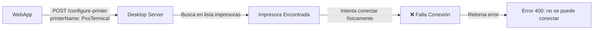

# 🔧 Análisis y Solución del Error "PosTermical" 

## 📋 Resumen del Problema

**Error específico**: `{"status":"error","message":"Impresora encontrada pero no se puede conectar:PosTermical"}`

### 🔍 Origen del Error

El error proviene del **proyecto Desktop (sellpos)** específicamente del archivo:
- `lib/core/services/http_server_service.dart` líneas 195-226
- Endpoint: `POST /configure-printer`

### 📊 Flujo del Error



## 🚨 Incompatibilidades Identificadas

| Aspecto | **WebApp (sell-web)** | **Desktop (sellpos)** |
|---------|----------------------|----------------------|
| **Configuración** | Solo valida y guarda nombre | Requiere conexión física real |
| **Validación** | Básica (nombre requerido) | Verifica disponibilidad + conecta |
| **Comportamiento** | Simulado/mock | Hardware real |
| **Respuesta Error** | Genérica | Específica de hardware |

## ✅ Mejoras Implementadas en WebApp

### 1. **Validación Mejorada de Nombres**
```dart
String _validatePrinterName(String name) {
  // Remueve caracteres especiales problemáticos
  String cleaned = name.trim().replaceAll(RegExp(r'[^\w\s\-_.]'), '');
  return cleaned.isEmpty ? 'POS-Printer-${DateTime.now().millisecondsSinceEpoch}' : cleaned;
}
```

### 2. **Selector de Nombres Comunes**
- Lista de nombres populares de impresoras térmicas
- Chips interactivos para selección rápida
- Nombres compatibles con detección hardware

### 3. **Manejo de Errores Específicos**
```dart
String _parseDesktopServerError(String error) {
  if (error.contains('no se puede conectar')) {
    return 'Error de conexión física con la impresora\n'
           'Soluciones: Verificar encendido, cables, controladores...';
  }
  // Más casos específicos...
}
```

### 4. **Verificación Previa del Servidor**
- Test de conectividad antes de configurar impresora
- Validación de respuesta del endpoint `/status`
- Mensajes de error más informativos

### 5. **UI Mejorada**
- Chips con nombres comunes de impresoras
- Sección de ayuda contextual
- Mensajes de error más específicos

## 🎯 Recomendaciones para Resolver "PosTermical"

### Para el Usuario Final:

1. **Verificar Servidor Desktop**
   ```bash
   # Asegurar que el servidor esté ejecutándose
   flutter run -d windows
   # O ejecutar el .exe compilado
   ```

2. **Buscar Impresoras Disponibles**
   - Abrir la aplicación Desktop
   - Usar el botón "Buscar Impresoras"
   - Verificar que "PosTermical" aparezca en la lista

3. **Probar Nombres Alternativos**
   - `POS-80`
   - `POS-80C`
   - `Receipt Printer`
   - `USB Receipt Printer`

4. **Verificar Hardware**
   - Impresora encendida
   - Cable USB conectado correctamente
   - Controladores instalados en Windows
   - Impresora visible en "Dispositivos e impresoras" de Windows

### Para el Desarrollador:

1. **Mejorar Detección en Desktop**
   ```dart
   // En sellpos/lib/core/services/http_server_service.dart
   // Línea ~200: Mejorar lógica de búsqueda de impresoras
   
   // Buscar por coincidencia parcial más flexible
   matchingPrinter = availablePrinters.where(
     (printer) => printer.name?.toLowerCase().contains(
       printerName.toLowerCase().split(' ').first
     ) ?? false
   ).firstOrNull;
   ```

2. **Implementar Fallback en Desktop**
   ```dart
   // Si falla conexión, devolver información útil
   return Response(400,
     body: jsonEncode({
       'status': 'error',
       'message': 'Impresora encontrada pero no se pudo conectar: $printerName',
       'suggestions': availablePrinters.map((p) => p.name).toList(),
       'troubleshooting': 'Verificar conexión física y controladores'
     }),
   );
   ```

3. **Modo de Prueba**
   ```dart
   // Agregar modo simulado para testing
   if (testMode) {
     return Response.ok(jsonEncode({
       'status': 'ok',
       'message': 'Impresora configurada en modo prueba',
       'testMode': true
     }));
   }
   ```

## 🔄 Compatibilidad entre Proyectos

### APIs que Deben Coincidir:

1. **POST /configure-printer**
   ```json
   // Request esperado por ambos
   {
     "printerName": "string (requerido)",
     "config": {
       "name": "string",
       "configuredAt": "ISO 8601"
     }
   }
   ```

2. **Responses Estandarizadas**
   ```json
   // Éxito
   { "status": "ok", "message": "...", "printer": "..." }
   
   // Error con sugerencias
   { 
     "status": "error", 
     "message": "...",
     "suggestions": ["POS-80", "Receipt Printer"],
     "troubleshooting": "..."
   }
   ```

## 📝 Próximos Pasos

1. **En Desktop (sellpos)**
   - [ ] Implementar búsqueda más flexible de nombres
   - [ ] Agregar modo de prueba/simulación
   - [ ] Mejorar mensajes de error con sugerencias
   - [ ] Implementar retry automático con nombres alternativos

2. **En WebApp (sell-web)**
   - [x] Validación de nombres mejorada
   - [x] Selector de nombres comunes
   - [x] Manejo de errores específicos
   - [x] UI mejorada con ayuda contextual

3. **Testing**
   - [ ] Probar con diferentes marcas de impresoras
   - [ ] Validar comportamiento con nombres especiales
   - [ ] Test de integración completo WebApp <-> Desktop

## 🎉 Resultado Esperado

Después de estas mejoras:
- ✅ Menos errores de configuración
- ✅ Mejor experiencia de usuario
- ✅ Mensajes de error más útiles
- ✅ Mayor compatibilidad entre proyectos
- ✅ Detección más robusta de impresoras

---

**Nota**: El error "PosTermical" es específico del hardware/controladores en el sistema Windows. Las mejoras implementadas ayudan a diagnosticar y resolver estos problemas más eficientemente.
