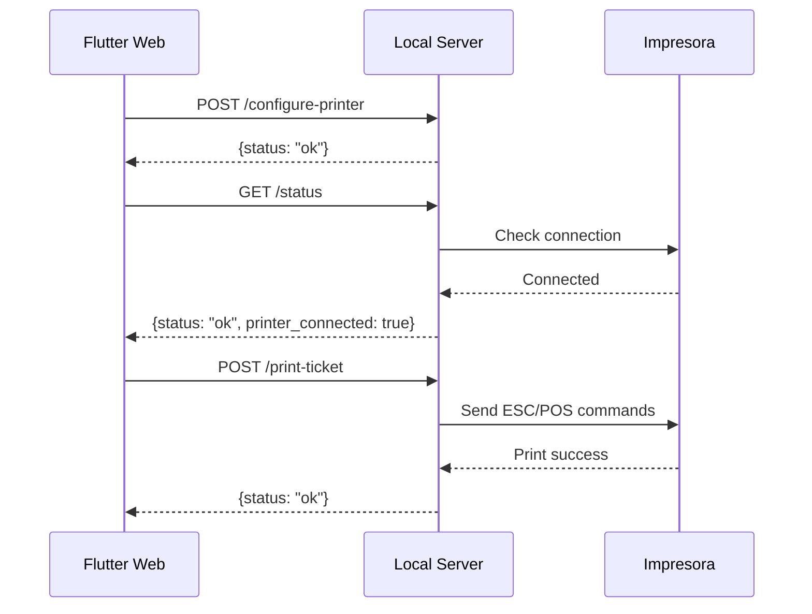

# 🖨️ Arquitectura Backend para `ThermalPrinterHttpService`

## 📋 Descripción General

`ThermalPrinterHttpService` es un servicio que permite a la aplicación web Flutter comunicarse con impresoras térmicas a través de HTTP. La comunicación se realiza con un **servidor HTTP local** que se ejecuta en una aplicación Flutter Desktop (Windows/macOS/Linux).

## 🏗️ Arquitectura Actual

```
┌─────────────────────────────────────────┐
│   Flutter Web App (sell-web)           │
│                                         │
│  ┌───────────────────────────────────┐ │
│  │ ThermalPrinterHttpService         │ │
│  │ - HTTP Client (package:http)      │ │
│  │ - Configuración de impresora      │ │
│  │ - Envío de tickets                │ │
│  └──────────────┬────────────────────┘ │
└─────────────────┼────────────────────────┘
                  │ HTTP
                  │ localhost:8080
                  ▼
┌─────────────────────────────────────────┐
│   Flutter Desktop App (Windows/Mac)    │
│                                         │
│  ┌───────────────────────────────────┐ │
│  │ HTTP Server (shelf o similar)     │ │
│  │ - Endpoints REST                  │ │
│  │ - Manejo de impresoras USB        │ │
│  │ - Generación de tickets ESC/POS   │ │
│  └───────────────┬───────────────────┘ │
└──────────────────┼──────────────────────┘
                   │ USB/Serial
                   ▼
          ┌─────────────────┐
          │ Impresora Térmica│
          └─────────────────┘
```

## 🔌 Endpoints del Servidor HTTP Local

### 1. **GET `/status`**
**Propósito:** Verificar que el servidor está activo

**Response:**
```json
{
  "status": "ok",
  "version": "1.0.0",
  "printer_connected": true,
  "printer_name": "EPSON TM-T20"
}
```

### 2. **POST `/configure-printer`**
**Propósito:** Configurar la impresora a utilizar

**Request:**
```json
{
  "printerName": "EPSON TM-T20",
  "config": {
    "name": "EPSON TM-T20",
    "devicePath": "/dev/usb/lp0",
    "customConfig": {},
    "configuredAt": "2025-11-27T10:30:00.000Z"
  }
}
```

**Response:**
```json
{
  "status": "ok",
  "message": "Impresora configurada exitosamente"
}
```

### 3. **POST `/print-ticket`**
**Propósito:** Imprimir un ticket de venta

**Request:**
```json
{
  "businessName": "Mi Negocio",
  "products": [
    {
      "name": "Producto 1",
      "quantity": 2,
      "price": 15.50,
      "total": 31.00
    }
  ],
  "total": 31.00,
  "paymentMethod": "Efectivo",
  "customerName": "Juan Pérez",
  "cashReceived": 50.00,
  "change": 19.00,
  "timestamp": "2025-11-27T10:35:00.000Z"
}
```

**Response:**
```json
{
  "status": "ok",
  "message": "Ticket impreso exitosamente",
  "printJobId": "abc123"
}
```

### 4. **POST `/test-printer`**
**Propósito:** Imprimir un ticket de prueba

**Request:**
```json
{
  "test": true,
  "timestamp": "2025-11-27T10:40:00.000Z"
}
```

**Response:**
```json
{
  "status": "ok",
  "message": "Ticket de prueba enviado"
}
```

## ⚠️ Consideraciones de Seguridad

### Problemas Actuales

1. **Sin Autenticación:** El servidor HTTP local no valida quién realiza las peticiones
2. **Sin Cifrado:** Las comunicaciones van en texto plano (HTTP, no HTTPS)
3. **CORS Permisivo:** Debe permitir requests desde el origen de la web app
4. **Inyección de Datos:** No valida exhaustivamente los datos recibidos

### Recomendaciones

#### 🔐 **Nivel 1: Seguridad Básica (Recomendado para Producción)**

```dart
// En el servidor HTTP local
class SecurityMiddleware {
  static const String API_KEY = 'YOUR_SECRET_API_KEY';
  
  bool validateRequest(Request request) {
    final apiKey = request.headers['X-API-Key'];
    return apiKey == API_KEY;
  }
}

// En ThermalPrinterHttpService
final headers = {
  'Content-Type': 'application/json',
  'X-API-Key': 'YOUR_SECRET_API_KEY', // Mejor: usar dotenv
};
```

#### 🛡️ **Nivel 2: Seguridad Mejorada (Opcional)**

```dart
// Generar token temporal por sesión
class TokenService {
  String generateSessionToken() {
    return uuid.v4(); // Token único por sesión
  }
  
  bool validateToken(String token) {
    // Validar que el token exista y no haya expirado
    return _activeTokens.containsKey(token) && 
           _activeTokens[token]!.isAfter(DateTime.now());
  }
}
```

#### 🔒 **Nivel 3: Máxima Seguridad (Enterprise)**

- Implementar HTTPS con certificados autofirmados
- Mutual TLS (mTLS) para validación bidireccional
- Rate limiting para prevenir abuso
- Logging de todas las operaciones

## 🚀 Implementación del Servidor Local

### Opción A: Usando `shelf` (Recomendado)

```dart
// lib/server/thermal_printer_server.dart
import 'package:shelf/shelf.dart';
import 'package:shelf/shelf_io.dart' as io;
import 'dart:convert';

class ThermalPrinterServer {
  HttpServer? _server;
  
  Future<void> start({int port = 8080}) async {
    final handler = Pipeline()
        .addMiddleware(logRequests())
        .addMiddleware(_corsHeaders())
        .addHandler(_router);
    
    _server = await io.serve(handler, 'localhost', port);
    print('🖨️ Server running on http://localhost:$port');
  }
  
  Middleware _corsHeaders() {
    return (Handler handler) {
      return (Request request) async {
        if (request.method == 'OPTIONS') {
          return Response.ok('', headers: _getCorsHeaders());
        }
        
        final response = await handler(request);
        return response.change(headers: _getCorsHeaders());
      };
    };
  }
  
  Map<String, String> _getCorsHeaders() {
    return {
      'Access-Control-Allow-Origin': 'http://localhost:3000', // Tu web app
      'Access-Control-Allow-Methods': 'GET, POST, OPTIONS',
      'Access-Control-Allow-Headers': 'Content-Type, X-API-Key',
    };
  }
  
  Response _router(Request request) {
    final path = request.url.path;
    
    switch (path) {
      case 'status':
        return _handleStatus(request);
      case 'configure-printer':
        return _handleConfigurePrinter(request);
      case 'print-ticket':
        return _handlePrintTicket(request);
      case 'test-printer':
        return _handleTestPrinter(request);
      default:
        return Response.notFound('Endpoint not found');
    }
  }
  
  Response _handleStatus(Request request) {
    return Response.ok(
      jsonEncode({
        'status': 'ok',
        'version': '1.0.0',
        'printer_connected': true,
      }),
      headers: {'Content-Type': 'application/json'},
    );
  }
  
  Future<Response> _handlePrintTicket(Request request) async {
    try {
      final body = await request.readAsString();
      final data = jsonDecode(body);
      
      // Validar datos
      if (data['products'] == null || data['total'] == null) {
        return Response.badRequest(
          body: jsonEncode({'status': 'error', 'error': 'Missing required fields'}),
        );
      }
      
      // Imprimir ticket usando ESC/POS
      await _printEscPos(data);
      
      return Response.ok(
        jsonEncode({'status': 'ok', 'message': 'Ticket printed'}),
        headers: {'Content-Type': 'application/json'},
      );
    } catch (e) {
      return Response.internalServerError(
        body: jsonEncode({'status': 'error', 'error': e.toString()}),
      );
    }
  }
  
  Future<void> _printEscPos(Map<String, dynamic> ticketData) async {
    // Implementar usando package:esc_pos_printer o similar
    // TODO: Conectar con impresora real
  }
}
```

### Opción B: Usando Cloud Function (Para Despliegue en Nube)

Si decides tener un backend en la nube (no local):

```dart
// Firebase Functions
import 'package:functions_framework/functions_framework.dart';

@CloudFunction()
Response function(Request request) async {
  // Validar autenticación con Firebase Auth
  final token = request.headers['Authorization']?.replaceFirst('Bearer ', '');
  
  if (token == null) {
    return Response.unauthorized('Missing auth token');
  }
  
  try {
    // Verificar token
    final decodedToken = await FirebaseAuth.instance.verifyIdToken(token);
    
    // Procesar request de impresión
    // Enviar a cola de impresión (Cloud Tasks o Pub/Sub)
    
    return Response.ok(jsonEncode({'status': 'queued'}));
  } catch (e) {
    return Response.forbidden('Invalid token');
  }
}
```

## 📦 Dependencias Necesarias

### Para el Servidor Local (Flutter Desktop)

```yaml
# pubspec.yaml del servidor
dependencies:
  shelf: ^1.4.0
  shelf_router: ^1.1.0
  uuid: ^4.0.0
  
  # Para impresión
  esc_pos_printer: ^4.1.0  # ESC/POS para impresoras térmicas
  esc_pos_utils: ^1.1.0
  
  # Para USB
  usb_serial: ^0.5.0  # Comunicación USB serial
```

### Para la Web App (Ya incluidas)

```yaml
# pubspec.yaml
dependencies:
  http: ^1.1.0
  injectable: ^2.3.0
  shared_preferences: ^2.2.0
```

## 🔄 Flujo de Comunicación



## 📝 TODO: Migraciones Pendientes

### ThermalPrinterHttpService - Instanciaciones Directas

**Archivos afectados:**
- `lib/features/sales/presentation/providers/sales_provider.dart:978`
- `lib/features/sales/presentation/dialogs/ticket_options_dialog.dart:39, 322`
- `lib/core/presentation/dialogs/views/configuration/printer_config_dialog.dart:21`

**Problema:** Crean instancias con `ThermalPrinterHttpService()` sin pasar `AppDataPersistenceService`

**Solución:** Inyectar el servicio en el constructor del widget/provider:

```dart
// ❌ Actual
final printerService = ThermalPrinterHttpService();

// ✅ Debe ser
class MyWidget extends StatefulWidget {
  final ThermalPrinterHttpService printerService;
  
  MyWidget({required this.printerService});
}

// O usar getIt temporal
final printerService = getIt<ThermalPrinterHttpService>();
```

## 🎯 Próximos Pasos

1. ✅ **Refactorizar servicios a DI** - COMPLETADO
2. ⚠️ **Crear servidor local con shelf** - PENDIENTE
3. ⚠️ **Implementar autenticación con API Key** - PENDIENTE
4. ⚠️ **Migrar instanciaciones directas a DI** - EN PROGRESO
5. ⚠️ **Testing end-to-end de impresión** - PENDIENTE

## 📚 Referencias

- [shelf package](https://pub.dev/packages/shelf)
- [esc_pos_printer](https://pub.dev/packages/esc_pos_printer)
- [ESC/POS Command Reference](https://reference.epson-biz.com/modules/ref_escpos/index.php)
